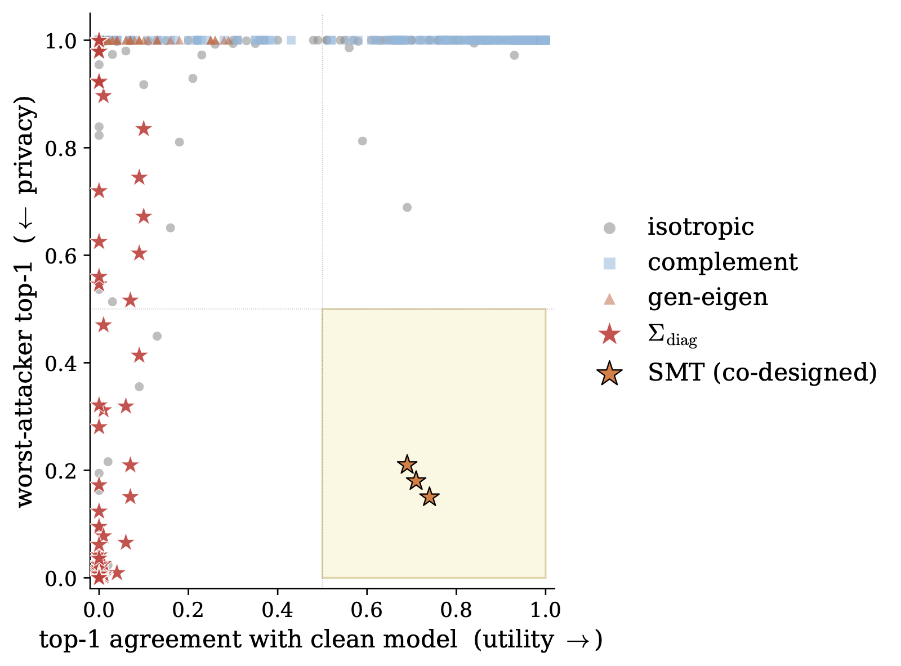

# tcc-research

Code and experimental results for the privacy of hidden-state release in decoder-only transformers: an inference-time noise mechanism against an adaptive retrieval attacker, paired with a constructive architecture that breaks the pretrained-model ceiling on the predictive privacy gain $G_{\mathrm{Mah}}$.

The repository supports two paired research questions: (1) given a fixed pretrained model, how should a defender add Gaussian noise to a released activation so that a Bayes-optimal attacker cannot recover the prompt while next-token distribution is preserved; and (2) is the high-$G_{\mathrm{Mah}}$ regime architecturally reachable when (1) bottoms out, and if so, how does it scale.



*Every Gaussian release cell across the 5-model 32-layer sweep, plotted in (utility, privacy) space. The shaded box is the moderate-both region (top-1 agreement ≥ 0.5, worst-attacker top-1 ≤ 0.5); zero Gaussian cells land inside it. The diagonal-Fisher mechanism rides the privacy edge but cannot enter. A split-memory transformer trained from scratch (orange stars at three probe layers of the same model) sits inside the box, the first existence proof that the moderate-both region is reachable from outside the Gaussian release class.*

## Headline results

- **Closed-form optimal defense against an adaptive attacker.** The Mahalanobis-optimal noise covariance is $\Sigma^\star_{\mathrm{Mah}} = (\kappa/\mathrm{tr}(C^{1/2}))\, F_\lambda^{-1/2} C^{1/2} F_\lambda^{-1/2}$ where $C = F_\lambda^{1/2} \Sigma_\delta F_\lambda^{1/2}$, $F$ is the hidden-state Fisher, and $\Sigma_\delta$ is the margin-direction covariance. Derived as a trace minimization with a scalar utility budget.
- **Predictive scalar.** $G_{\mathrm{Mah}} = \mathrm{tr}(F_\lambda)\,\mathrm{tr}(\Sigma_\delta) / [\mathrm{tr}(C^{1/2})]^2$ forecasts the gain over isotropic noise against a covariance-aware attacker. Measured in the range 1.7–9.3 across GPT-2 Small, Mistral-7B, Phi-2, Qwen3-14B, DeepSeek-R1-14B.
- **The 13× Pareto defense is a Euclidean-attacker artifact.** Under plain $\ell_2$ retrieval, generalized-eigen noise on the top-128 eigenvectors of $(\Sigma_\delta, F)$ suppresses attack success by 13× on Mistral-7B. Under the adaptive Mahalanobis attacker the noise lives entirely in a rank-128 subspace the attacker can project out, and attack success goes back to 100% at every noise level.
- **A simple mechanism that survives.** $\Sigma_{\mathrm{diag}} = \sigma^2\,\mathrm{diag}(1/F_{ii})$ — diagonal, full-rank, coordinate-weighted by inverse Fisher — is the only Gaussian release that achieves worst-over-attackers top-1 ≤ 0.001 at $\sigma = 5$ across every (model, layer) point we tested. It is also the unique diagonal covariance with equal per-coordinate first-order KL cost.
- **Empty middle.** Across 1,536 (mechanism, $\sigma$, model, layer) cells, zero achieve both t1-agreement ≥ 0.5 with the clean model and worst-attacker top-1 ≤ 0.5.
- **Sequence inverter survives the empty middle.** A 57M-parameter full-trajectory inverter recovers 94% of clean GPT-2 prefixes at exact match, drops to 22.6% under isotropic at $\sigma = 5$, and to 0% under $\Sigma_{\mathrm{diag}}$ at the same $\sigma$. Token accuracy under $\Sigma_{\mathrm{diag}}$ is 1.1%, chance level for a 50,257-token vocabulary.
- **Constructive existence proof: the Split-Memory Transformer.** A 12-layer, 90M-parameter SMT trained from scratch with the output projection reading only from a narrow predictive trunk reaches $G_{\mathrm{Mah}} \in [20, 33]$ across three probe layers, against a same-budget GPT baseline at 1.1–1.3. Pretrained models top out at 9.3.
- **Fixed-token SMT scaling sweep, 30M to 1B parameters.** SMT maintains a 6–24× $G_{\mathrm{Mah}}$ advantage over matched-$d$ GPT baselines across a 33× param range. Baselines remain flat at $G_{\mathrm{Mah}} \approx 1.3$. The architectural gain is mediated by the Fisher–margin coupling $q_B$, which collapses from 0.78 to 0.07 across the SMT sweep but stays at 0.75 ± 0.04 for baselines. The fixed-token LM-loss penalty widens with scale (+1.18 to +2.15 nats), a fixed-compute observation that does not constrain the long-run penalty under data-optimal training.
- **Training-time DP does not help inference release.** DP-SGD fine-tuning at $\varepsilon \in \{2, 4, 8\}$ leaves held-out retrieval top-1 at 1.000.

Numbers in the paper's tables are reproducible from the JSONs under `artifacts/`. Trained model checkpoints and other large artifacts (~22 GB) are released as a supplementary zip alongside the OpenReview submission rather than checked into the repository.

## For researchers

### Layout
- `two_channel/mahalanobis_defense.py` — solves the Mahalanobis-optimal $\Sigma^\star_{\mathrm{Mah}}$ and computes $G_{\mathrm{Mah}}$, $G_{\mathrm{Euc}}$.
- `two_channel/mahalanobis_attacker.py` — Bayes-optimal retrieval with $(q-c)^\top (\Sigma + \tau I)^{-1} (q-c)$; $\tau$ tuned on held-out.
- `two_channel/rdp_accountant.py` — Rényi-DP accountant $\varepsilon_\alpha(\Sigma) = (\alpha/2)\sup_{\Delta} \Delta^\top \Sigma^{-1} \Delta$ over an adjacency set.
- `two_channel/adjacency_builder.py` — constructs the empirical adjacency $\mathcal{A}$ per model.
- `two_channel/sdp_worst_case.py` — cvxpy SDP for reduced-basis worst-case DP covariance.
- `two_channel/learned_inverter.py` — 6-layer decoder with activation cross-attention; single-vector attack upper bound.
- `two_channel/exp_sequence_inverter.py` — full-trajectory sequence inverter (per-token linear projection of the released hidden state, mechanism-aware training).
- `two_channel/split_memory_transformer.py` — SMT layer and full model; trunk-memory factoring with asymmetric cross-coupling and trunk-only readout.
- `two_channel/exp_smt_train.py`, `exp_smt_measure.py` — SMT training (with optional Hutchinson Jacobian penalty) and $G_{\mathrm{Mah}}$ probing.
- `two_channel/compute_subspace.py` — empirical Fisher $F$ and margin covariance $\Sigma_\delta$ at an arbitrary layer.
- `two_channel/exp_mahalanobis.py` — full defense × attacker × mechanism sweep (the script that produces `artifacts/mahalanobis/*.json`).
- `two_channel/exp_matched_eps.py`, `exp_rdp_curves.py` — matched-$\varepsilon$ and RDP curves.
- `two_channel/exp_dp_sgd.py` — DP-LoRA fine-tune + inference-time retrieval eval (Opacus).
- `two_channel/exp_learned_inverter.py` — single-vector inverter training (GPT-2 Small, Mistral-7B).
- `two_channel/exp_isotropy_check.py` — fixed-projector isotropy measurement.
- `two_channel/exp_layer_sweep.py`, `exp_scaling_points.py` — per-layer and per-model sweeps.
- `launch_smt_scaling.sh`, `launch_smt_scaling_measure.sh`, `launch_smt_scaling_measure_parallel.sh` — 3-lane parallel SMT scaling sweep (4 tiers × 2 arms + 3 seeds + 2 step counts at 90M; 16 runs total) and parallel $G_{\mathrm{Mah}}$ measurement.
- `artifacts/mahalanobis/runpod_L_*/` — per-layer defense sweeps for each model (primary result files).
- `artifacts/matched_eps/`, `artifacts/rdp/` — DP accounting.
- `artifacts/learned_inverter/`, `artifacts/sequence_inverter/` — single-vector and full-trajectory inverter training/eval.
- `artifacts/dp_sgd/` — DP-SGD negative baseline.
- `artifacts/sdp/` — worst-case SDP (GPT-2).
- `artifacts/isotropy/` — fixed-projector isotropy checks.
- `artifacts/layer_sweep/` — GPT-2 layer sweep.
- `artifacts/quotient_release/` — predictive-quotient (variational bottleneck) sweep, the 0/44 negative result.
- `artifacts/smt/` — 90M SMT training logs and per-probe-layer measurements (the four 12-layer architectures).
- `artifacts/smt_scaling/` — SMT scaling sweep JSONs (16 measure files plus per-step training logs across 30M / 90M / 300M / 1B at fixed 164M tokens). Final-step `.pt` checkpoints for the 16 runs are in the supplementary zip.

### Reproducing a result
Closed-form Mahalanobis defense on Mistral-7B, layer 16:
```
python -m two_channel.exp_mahalanobis --model mistralai/Mistral-7B-v0.1 --layer 16 --k 128 --n_cal 500 --n_bank 50000 --n_query 2000
```
Produces `artifacts/mahalanobis/mahalanobis_mistralai_Mistral-7B-v0.1.json` with $G_{\mathrm{Euc}}$, $G_{\mathrm{Mah}}$, the top generalized eigenvalues, and the full 9-mechanism × 6-$\sigma$ × 3-attacker sweep. End-to-end wall-clock on an H100 is ≈45 minutes.

Matched-$\varepsilon$ curves:
```
python -m two_channel.exp_matched_eps --model mistralai/Mistral-7B-v0.1 --layer 16 --k 128
```

DP-SGD baseline (GPT-2 Small):
```
python -m two_channel.exp_dp_sgd --eps_target 2 --delta 1e-6
```
Produces `artifacts/dp_sgd/dp_sgd_eps2.json`.

SMT 90M training and $G_{\mathrm{Mah}}$ probe at $\ell \in \{4, 6, 8\}$:
```
python -m two_channel.exp_smt_train --arch smt --r 128 --m 640 --n_layers 12 --steps 20000 --lambda_jac 1e-3 --probe_layers 4,6,8 --tag main
python -m two_channel.exp_smt_measure --ckpt artifacts/smt/smt_main_r128_m640_lj0.001_seed0.final.pt --probe_layers 4,6,8
```

Full SMT scaling sweep (3 H100s, ~19h wall, ~$170 on RunPod):
```
bash launch_smt_scaling.sh 0 &
bash launch_smt_scaling.sh 1 &
bash launch_smt_scaling.sh 2 &
wait
bash launch_smt_scaling_measure_parallel.sh 0 &
bash launch_smt_scaling_measure_parallel.sh 1 &
bash launch_smt_scaling_measure_parallel.sh 2 &
wait
```
Produces 16 `.measure.json` files and 16 `.final.pt` checkpoints under `artifacts/smt_scaling/`.

Full reproduction of every paper number takes ≈290 GPU-hours on a mix of H100 (for the SMT scaling sweep, 7B/14B defense sweeps, and Mistral learned-inverter training) and A10G (for GPT-2 sweeps and DP-SGD).

## For practitioners

If you are caching or transmitting hidden-state activations from a decoder-only transformer and want a Gaussian release that blocks a retrieval-based inversion attacker, the short answer is:

1. Compute $F_{ii}$, the diagonal of the empirical Fisher, on a calibration set of prompts at your chosen layer. $O(d)$ memory, one forward+backward pass per calibration prefix.
2. Release $\tilde h = h + \xi$, $\xi \sim \mathcal{N}(0, \sigma^2\,\mathrm{diag}(1/F_{ii}))$ for a noise scale $\sigma$ chosen by your utility budget. A minimal snippet:
   ```
   from two_channel.compute_subspace import fisher_diagonal
   F_diag = fisher_diagonal(model, calibration_prefixes, layer=ell)
   noise_cov = sigma**2 / F_diag        # shape (d,)
   released = h + noise_cov.sqrt() * torch.randn_like(h)
   ```
3. What you get: attack success ≤ 0.001 at $\sigma = 5$ on every model and layer we tested, and 0% exact-match recovery under a full-trajectory sequence inverter that recovers 94% of clean prefixes. The per-coordinate noise budget is invariant across layers because noise mass $\sigma^2 d$ absorbs variation in $\mathrm{tr}(F)$.
4. What you do *not* get: utility preservation. At $\sigma = 5$ the next-token distribution is badly corrupted (KL ≥ 5 nats on every model). The empty-middle result says that no Gaussian mechanism we tested achieves both t1-agreement ≥ 0.5 and attack top-1 ≤ 0.5 simultaneously. If your utility budget is tighter, pick a smaller $\sigma$ and accept a proportionally stronger attacker.
5. What *not* to do: do not use a rank-$k$ defense (gen-eigen, complement, random projection). They all collapse to 100% attack success under an adaptive Mahalanobis attacker because their covariance is singular. They only help against a naive $\ell_2$ attacker.
6. DP-SGD fine-tuning does not substitute for inference-time noise — our DP-SGD baseline at $\varepsilon \in \{2, 4, 8\}$ leaves fresh-prompt retrieval at 100%.
7. If you control architecture as well, the SMT scaling sweep gives empirical evidence that a trunk-confined readout reaches $G_{\mathrm{Mah}}$ an order of magnitude above any pretrained model we tested across 30M to 1B parameters, while paying a fixed-token LM-loss penalty whose long-run behaviour is not yet determined.

## Supplementary materials

The following are too large to track in git and are released as a supplementary zip alongside the paper:

- 16 SMT scaling-sweep checkpoints (30M / 90M / 300M / 1B SMT and matched baselines, plus 90M seed and step variants), ≈17 GB total.
- 8 SMT 90M-tier checkpoints (the four 12-layer architectures plus their `step10000` snapshots), ≈2.9 GB.
- 88 PQR sweep checkpoints (44 cells × 2 stages of the predictive-quotient negative result), ≈161 MB.
- Per-layer empirical Fisher diagonals $F_{ii}$ for the 32-point sweep (model × layer matrix), released as `.npy` arrays.

The supplementary zip mirrors the `artifacts/smt_scaling/`, `artifacts/smt/`, and `artifacts/quotient_release/` layout of this repository, so a single `unzip -d artifacts/` recreates the local layout.

## Install
```
pip install -r requirements.txt
```
Requires PyTorch (with CUDA for 7B/14B runs and the SMT scaling sweep), Hugging Face `transformers` + `datasets`, `opacus` (for the DP-SGD baseline), `cvxpy` (for the SDP baseline), `faiss-cpu` (optional, for larger retrieval banks).

## License
MIT.
